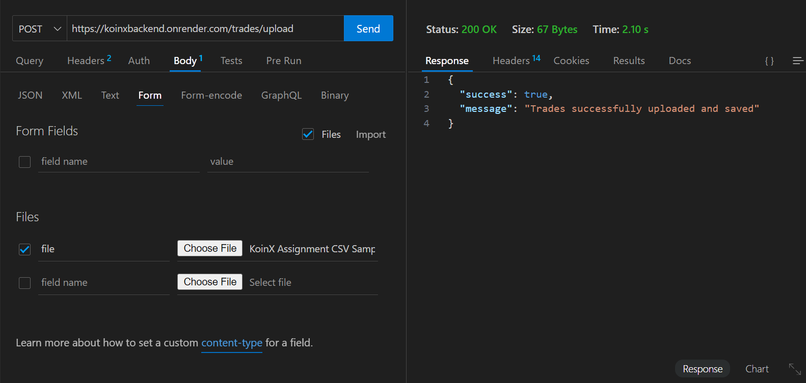
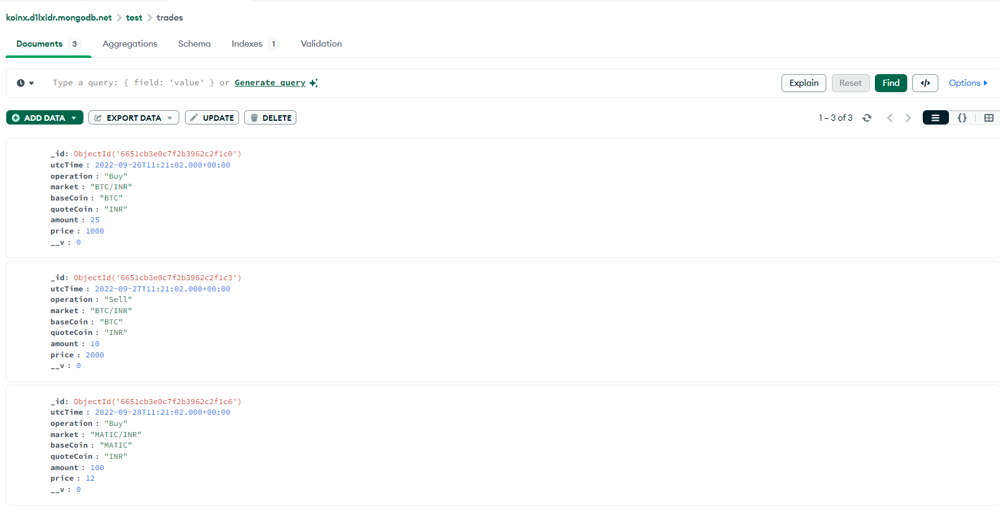
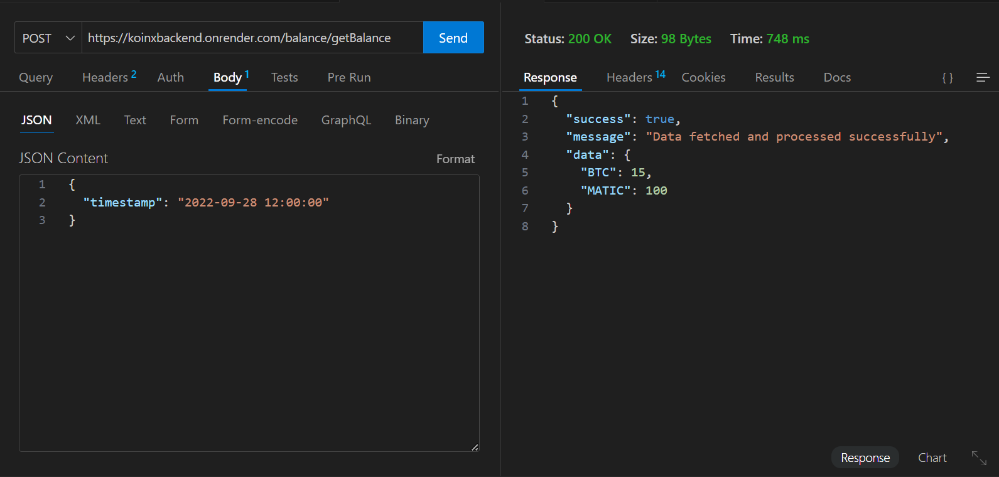
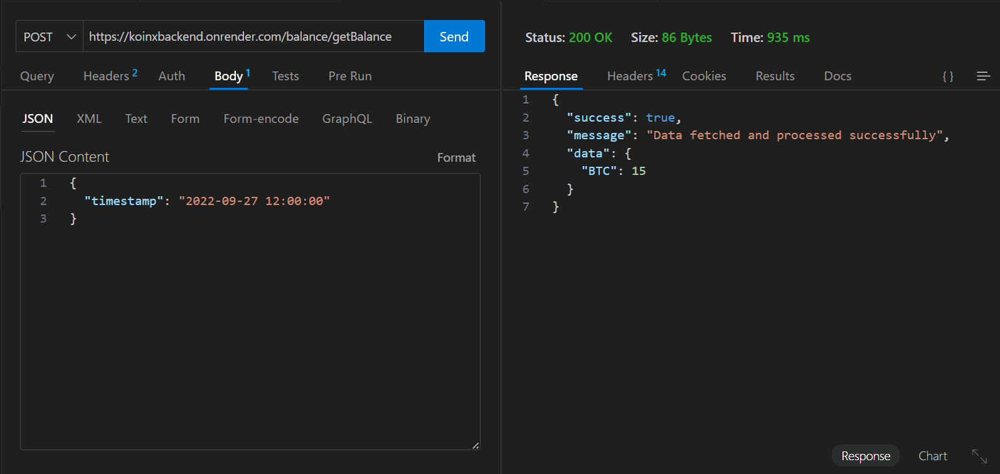

# Trade Parser and Balance Calculator

This is a Node.js application for parsing cryptocurrency trade data from CSV files and calculating asset balances at a given timestamp.

## Features

- Upload CSV files containing trade data
- Store parsed data in MongoDB
- Calculate asset balances at a given timestamp

# API Endpoints

## Upload Trades

- **URL**: `/trades/upload`
- **Method**: `POST`
- **Description**: Uploads a CSV file containing trade data and processes it.
- **Request**: `multipart/form-data` with a file field named `file`.

## Get Balance

- **URL**: `/balance/getBalance`
- **Method**: `POST`
- **Description**: Calculates the balance of assets at a given timestamp.
- **Request Body**:
  ```json
  {
    "timestamp": "2022-09-28T12:00:00"
  }


## Setup

1. Clone the repository
2. Install dependencies: `npm install`
3. Set up environment variables in `.env` file
4. Start the server: `npm start`

# Description of Each Directory and File

- **config/**
  - **db.js**: Contains the database configuration and connection logic.

- **controllers/**
  - **tradeController.js**: Handles HTTP requests related to trades and acts as a bridge between services and routes.
  - **balanceController.js**: Handles HTTP requests related to balance calculations.

- **middlewares/**
  - **errorHandler.js**: Middleware for handling errors globally across the application.

- **models/**
  - **trade.js**: Defines the Mongoose schema and model for trades, encapsulating the database structure for trade documents.

- **routes/**
  - **index.js**: Main router that combines all individual route modules.
  - **tradeRoutes.js**: Defines routes related to trade operations.
  - **balanceRoutes.js**: Defines routes related to balance calculations.

- **services/**
  - **tradeService.js**: Contains business logic related to trade operations, such as parsing and inserting trades.
  - **balanceService.js**: Contains business logic for calculating balances at a given timestamp.

- **utils/**
  - **csvParser.js**: Utility function for parsing CSV files.

- **uploads/**: Directory to store uploaded CSV files temporarily.

- **.env**: Stores environment variables, such as database connection strings and other configuration settings.

- **.gitignore**: Specifies files and directories that should be ignored by Git, such as `node_modules/` and environment files.

- **package.json**: Defines the dependencies, scripts, and metadata for the Node.js project.

- **README.md**: Provides an overview of the project, how to set it up, and usage instructions.

- **server.js**: The main file that initializes the Express.js application and sets up middleware, routes, and the server.

## Deployment
1. Deployed MongoDB server on MongoAtlas (link added on .env)
2. Deployed Backend(Node) Server on Render: https://koinxbackend.onrender.com







